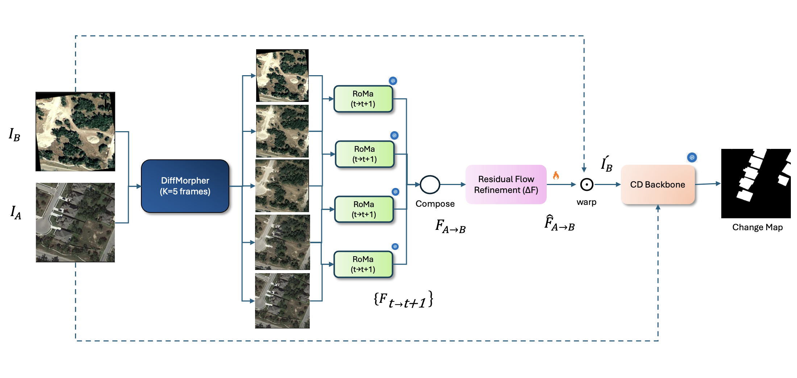

<div align="center">

# Morphing Through Time
### Diffusion-Based Bridging of Temporal Gaps for Robust Alignment in Change Detection

Seyedehanita Madani · Vishal M. Patel

[](https://arxiv.org/abs/2511.07976)
[-lightgrey.svg)](LICENSE)

</div>

Bi-temporal remote-sensing images are often separated by large **temporal gaps** and
suffer from **spatial misalignment** (parallax, viewpoint, seasonal change). This makes
dense registration hard and hurts downstream change detection (CD). *Morphing Through
Time* bridges the gap by **synthesizing intermediate frames** with a diffusion morpher,
registering **step by step**, and **refining** the composed flow — improving alignment
**without altering the CD network** itself.

### Pipeline

<p align="center">
  
</p>

Given a bi-temporal pair `(I_A, I_B)`, **DiffMorpher** synthesizes `K=5` intermediate
frames; **RoMa** estimates the flow between consecutive frames, which is **composed** into
`F_{A→B}`; a **residual flow refinement** U-Net corrects it to `F̂_{A→B}`; the refined flow
**warps** `I_B` onto `I_A`, and the aligned pair is fed to any (frozen) **CD backbone**.

> **Note.** This is a modular **research pipeline** run as a few sequential steps (not a
> single command). Each stage reads the previous stage's output from disk.

## Repository layout

```
MorphingThroughTime/
├── stage1_morph/          # diffusion morphing (DiffMorpher fork, S-Lab License)
│   ├── model.py  utils/   # DiffMorpher pipeline
│   ├── morph_pair.py      # morph a single image pair
│   └── run_dataset.py     # morph a whole CD dataset (A/ vs B/)
├── stage2_register/
│   └── compose_flow.py    # stepwise RoMa + flow composition → roma_flow.npy
├── stage3_refine/
│   ├── residual_refiner.py    # ResidualRefinerNet + dataset + training
│   ├── eval_refiner.py        # evaluation + warping
│   └── prepare_refiner_data.py# place roma_flow.npy / gt_flow.npy per sample
├── scripts/download_weights.sh
├── requirements.txt  LICENSE  ACKNOWLEDGEMENTS.md  CITATION.cff
```

## Installation

```bash
git clone <your-repo-url> MorphingThroughTime
cd MorphingThroughTime
pip install -r requirements.txt
# RoMa is not on PyPI — install from source:
pip install git+https://github.com/Parskatt/RoMa.git
```

Stable Diffusion 2.1 and RoMa weights download automatically on first run.

## Datasets

Download from the original sources and arrange each as aligned `A/` (before) and
`B/` (after; typically an affine-perturbed `B_affine/`) image folders:

| Dataset  | Link |
|----------|------|
| LEVIR-CD | https://chenhao.in/LEVIR/ |
| WHU-CD   | https://gpcv.whu.edu.cn/data/building_dataset.html |
| DSIFN-CD | https://github.com/GeoZcx/A-deeply-supervised-image-fusion-network-for-change-detection-in-remote-sensing-images |

## Running the pipeline

**Stage 1 — morph** (produces `<out>/<sample>/00.png … 04.png`):

```bash
cd stage1_morph
python run_dataset.py \
    --dir_a /path/LEVIR-CD256/train/A \
    --dir_b /path/LEVIR-CD256/train/B_affine \
    --out   outputs/levir_morph \
    --prompt_0 "satellite photo of a neighborhood before new buildings were built" \
    --prompt_1 "satellite photo of the same neighborhood with newly constructed buildings"
```

**Stage 2 — stepwise RoMa + compose** (writes `roma_flow.npy` into each sample folder):

```bash
cd ../stage2_register
python compose_flow.py \
    --morph_dir ../stage1_morph/outputs/levir_morph \
    --out_dir   warped_levir \
    --gt_flow_dir /path/LEVIR-CD256/eval/flow_gt_npy   # optional, for EPE/ECE
```

**Prepare Stage-3 data** — each sample folder needs `00.png, 04.png, roma_flow.npy, gt_flow.npy`.
Stage 2 already wrote `roma_flow.npy`; copy the ground-truth (affine) flow in:

```bash
cd ../stage3_refine
python prepare_refiner_data.py \
    --src /path/LEVIR-CD256/train/flow \
    --dst ../stage1_morph/outputs/levir_morph \
    --name gt_flow.npy
```

**Stage 3 — train the residual refiner:**

```bash
python residual_refiner.py \
    --data ../stage1_morph/outputs/levir_morph \
    --ckpt_dir checkpoints/levir --epochs 20
```

**Stage 3 — evaluate & warp:**

```bash
python eval_refiner.py \
    --data_dir ../stage1_morph/outputs/levir_morph \
    --ckpt checkpoints/levir/flow_epoch_20.pth \
    --split test --pred_format fwd_px --gt_format fwd_px \
    --vis_dir vis_levir --csv_path eval_levir.csv
```

The refined flow warps the "after" image onto the "before" image; feed the aligned pair
to any existing CD network unchanged.

## Pretrained weights

Only the trained Stage-3 refiner checkpoints are hosted (SD 2.1 / RoMa auto-download):

```bash
pip install -U huggingface_hub
export MTT_HF_REPO=<HF_USER>/MorphingThroughTime   # set once weights are uploaded
bash scripts/download_weights.sh
```

## Citation

```bibtex
@article{madani2025morphing,
  title   = {Morphing Through Time: Diffusion-Based Bridging of Temporal Gaps for Robust Alignment in Change Detection},
  author  = {Madani, Seyedehanita and Patel, Vishal M.},
  journal = {arXiv preprint arXiv:2511.07976},
  year    = {2025}
}
```

## License & acknowledgements

`stage1_morph/` is derived from **DiffMorpher** under the **S-Lab License 1.0**
(non-commercial research use), so the repository as a whole is for non-commercial
research. It also uses **RoMa** and **Stable Diffusion 2.1**. See
[LICENSE](LICENSE) and [ACKNOWLEDGEMENTS.md](ACKNOWLEDGEMENTS.md).
